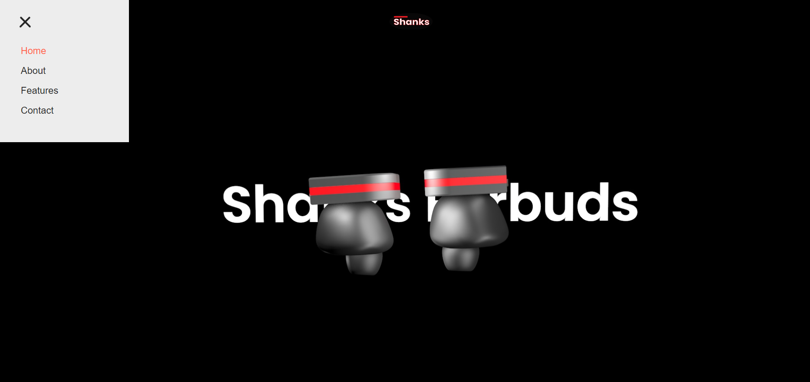

# Ear_buds_Submission_1
 
Earbuds Sbmission 1 is all about to make our 3D earbuds AR, with some of the best practices that were taught in class implimenting hotspots and adding hover effect as well as onclick event on them with the help of javascript. best practices of array is implimented in the project.
 
# Overview

1. Took the exported AR object and code created in MMED-1058, and integrate it
into the promo site.
2. Used a combination of CSS3, Javascript and the GreenSock library to animate
the hotspots and display information.
3. # Scroll-Based Animation
The scroll-based animation section appears to be using the GreenSock Animation Platform (GSAP) for creating a frame-based animation triggered by scrolling. Here's a breakdown:
Canvas Setup: A canvas element with an ID of "explode-view" is created, and its context is obtained.
Frame Configuration: frameCount is set to 150, representing the total number of frames. An array named images is created to store the Image objects for each frame.
Image Loading Loop: A loop iterates over the frames, creating new Image objects and setting their source based on the frame number. These images are then pushed into the images array.
GSAP Animation Configuration: GSAP is used to animate the buds object's frame property. The animation is triggered by scrolling on the element with the ID "explode-view". It uses a pinning effect, scrubbing for smoother animation, and starts when the top of the "explode-view" element reaches the top of the viewport.
Rendering Function: The render function is called on each frame update. It clears the canvas and draws the current frame's image.

4. # X-Ray Slider
The X-ray slider section handles a slider for revealing an image. Here's the breakdown:
Element Selection: The script selects necessary DOM elements - imageCon for the container, drag for the draggable element, and left for the left side of the revealed image.
Event Listeners: Event listeners are set up for mouse interactions (mousedown, mouseup, and mousemove). These events control the dragging of the drag element horizontally within the container.
Drag Logic: The onMove function calculates the horizontal position of the drag element, ensuring it stays within bounds. The left side of the revealed image is adjusted accordingly.
Hotspots
The Hotspots section appears to be related to a model viewer with interactive hotspots. Here's the breakdown:
Model and Hotspot Selection: The model and hotspots are selected from the DOM.
Information Data: Information for each hotspot is stored in the infoBoxes array, containing title, text, and image properties.

# Functions:

modelLoaded: Displays the hotspots when the model is loaded.
loadInfo: Loads information based on the selected hotspot from the infoBoxes.
showInfo and hideInfo: Display and hide information boxes with a fade-in/fade-out effect.
Event Listeners: Event listeners are set up for mouseover, mouseout, and click events on hotspots, triggering the corresponding functions.

This breakdown can be used as a guide for creating a readme file, explaining each section's purpose and functionality.

# version / history
1.0 - Pulled out code and the AR obejct, Implimented basic folder structure practice that were taught in the class, set up the sass and js at the initial phase
2.0 - fixed issues in js, sass and HTMl 
3.0 - responsive for mobile, tablet and desktop

# how to use
1. Clone the repo / Download the files
2. Load it in your system
3. Run it with Vscode and open the live server. Have fun

# License 
MIT

# Special Thanks
Professor Marco De Luca 
(co-ordinator of IDP at Fanshawe School Of Digital and Performing Arts)

# Creator

Dev Pandya (Dev1ce)